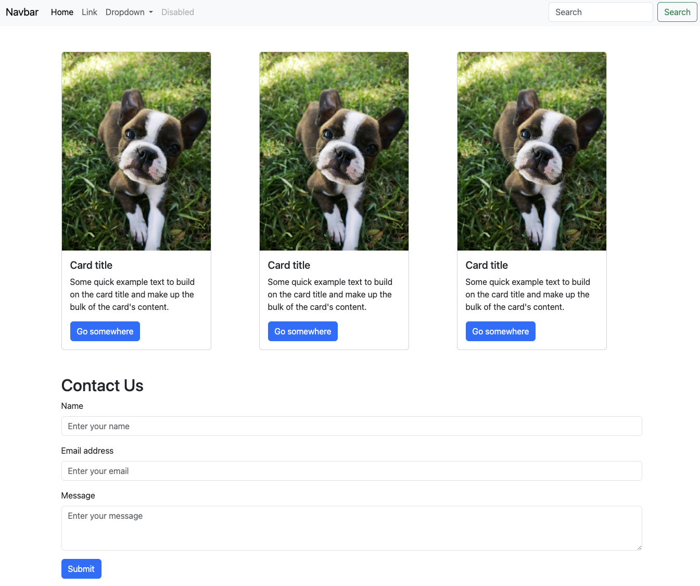

# Bootstrap Basics



## Description 📄

In this project, you'll learn to build a simple webpage using Bootstrap. You will find the Bootstrap documentation [here](https://getbootstrap.com/docs/5.3/getting-started/introduction), where you can explore a wide range of components and utilities. You'll add a responsive navbar, incorporate Bootstrap cards, buttons, and forms.

## Expected Project Structure 🏗️

```
bootstrap_basics/
  assets/
  | css
    | styles.css
  |  images
    | complete.png
    | puppy.jpg

  index.html
  README.md
```
# Instructions ✅

## 1. **Create the Project Folder and Files**

- [ ] Create a folder named `bootstrap_basics` to store all your project files.
- [ ] Inside the `bootstrap_basics` folder, create a file named `index.html`. This will be your main HTML file.
- [ ] Inside the `assets` folder, create a new folder called `css`. Inside the `css` folder, create a file named `styles.css`. This file will contain the CSS used to style your HTML content.

## 2. **Add HTML Boilerplate**

Now that you have your files set up, start by adding the basic HTML5 boilerplate as seen below to set up the foundation of your document in `index.html`.

```html
<!DOCTYPE html>
<html lang="en">
<head>
  <meta charset="UTF-8">
  <meta name="viewport" content="width=device-width, initial-scale=1.0">
  <title>Bootstrap Basics</title>
<<<<<<< HEAD
  <link rel="stylesheet" href="/assets/css/styles.css">
=======
  <link rel="stylesheet" href="assets/styles.css">
>>>>>>> 2b1ae444af3a32c6809930aceaab0ee8e45f13ed
</head>
<body>
  <!-- Your content goes here -->
</body>
</html>
```
**Explanation:**

-   Declares the document as HTML5 and sets up the essential metadata and styles.

## 3. **Add Bootstrap CDN**

To include Bootstrap in your project, add the following CDN link to the `<head>` of your `index.html` file:

```html
<link href="https://cdn.jsdelivr.net/npm/bootstrap@5.3.0/dist/css/bootstrap.min.css" rel="stylesheet">
```

Your `<head>` section should now look like this:

```html
<head>
  <meta charset="UTF-8">
  <meta name="viewport" content="width=device-width, initial-scale=1.0">
  <title>Bootstrap Basics</title>
  <link href="https://cdn.jsdelivr.net/npm/bootstrap@5.3.0/dist/css/bootstrap.min.css" rel="stylesheet">
<<<<<<< HEAD
  <link rel="stylesheet" href="/assets/css/styles.css">
=======
  <link rel="stylesheet" href="assets/styles.css">
>>>>>>> 2b1ae444af3a32c6809930aceaab0ee8e45f13ed
</head>
```
**Explanation:**

-   The Bootstrap CDN link allows you to use Bootstrap's CSS and components in your project. [Bootstrap CDN Documentation](https://getbootstrap.com/docs/5.3/getting-started/download/)
-   It's important to note that the bootstrap versions being utilized by a CDN can change frequently. Be sure to check the documentation for the latest version being utilized.

## 4. **Add a Navbar**

To create a responsive navbar using Bootstrap, add the following code to your `index.html`:

```html
<nav class="navbar navbar-expand-lg bg-body-tertiary">
  <div class="container-fluid">
    <a class="navbar-brand" href="#">Navbar</a>
    <button class="navbar-toggler" type="button" data-bs-toggle="collapse" data-bs-target="#navbarSupportedContent" aria-controls="navbarSupportedContent" aria-expanded="false" aria-label="Toggle navigation">
      <span class="navbar-toggler-icon"></span>
    </button>
    <div class="collapse navbar-collapse" id="navbarSupportedContent">
      <ul class="navbar-nav me-auto mb-2 mb-lg-0">
        <li class="nav-item">
          <a class="nav-link active" aria-current="page" href="#">Home</a>
        </li>
        <li class="nav-item">
          <a class="nav-link" href="#">Link</a>
        </li>
        <li class="nav-item dropdown">
          <a class="nav-link dropdown-toggle" href="#" role="button" data-bs-toggle="dropdown" aria-expanded="false">
            Dropdown
          </a>
          <ul class="dropdown-menu">
            <li><a class="dropdown-item" href="#">Action</a></li>
            <li><a class="dropdown-item" href="#">Another action</a></li>
            <li><hr class="dropdown-divider"></li>
            <li><a class="dropdown-item" href="#">Something else here</a></li>
          </ul>
        </li>
        <li class="nav-item">
          <a class="nav-link disabled" aria-disabled="true">Disabled</a>
        </li>
      </ul>
      <form class="d-flex" role="search">
        <input class="form-control me-2" type="search" placeholder="Search" aria-label="Search">
        <button class="btn btn-outline-success" type="submit">Search</button>
      </form>
    </div>
  </div>
</nav>
```
**Explanation:**

-   Creates a responsive navigation bar that collapses on smaller screens. [Bootstrap Navbar Documentation](https://getbootstrap.com/docs/5.3/components/navbar/)

## 5. **Add a Few Cards**

Use Bootstrap's card component to display content. Each card should have an image, a title, some text, and a button. Add the following code to your `index.html`:
```html
<div class="container my-5">
  <div class="row">
    <div class="col-md-4">
      <div class="card" style="width: 18rem;">
        
        <div class="card-body">
          <h5 class="card-title">Card title</h5>
          <p class="card-text">
            Some quick example text to build on the card title and make up the bulk of the card's content.
          </p>
          <a href="#" class="btn btn-primary">Go somewhere</a>
        </div>
      </div>
    </div>
    <!-- Repeat the card structure here for more cards -->
  </div>
</div>

```
**Explanation:**

-   Adds Bootstrap cards with images, titles, text, and buttons. [Bootstrap Card Documentation](https://getbootstrap.com/docs/5.3/components/card/)

## 6. **Add a Form**

Below the cards, add a form using Bootstrap's form components:
```html
<div class="container my-5">
  <h2>Contact Us</h2>
  <form>
    <div class="mb-3">
      <label for="name" class="form-label">Name</label>
      <input type="text" class="form-control" id="name" placeholder="Enter your name">
    </div>
    <div class="mb-3">
      <label for="email" class="form-label">Email address</label>
      <input type="email" class="form-control" id="email" placeholder="Enter your email">
    </div>
    <div class="mb-3">
      <label for="message" class="form-label">Message</label>
      <textarea class="form-control" id="message" rows="3" placeholder="Enter your message"></textarea>
    </div>
    <button type="submit" class="btn btn-primary">Submit</button>
  </form>
</div>
```
**Explanation:**

-   Adds a form with fields for name, email, and message, and a submit button. [Bootstrap documentation on forms layout](https://getbootstrap.com/docs/5.3/forms/layout/)

## 7. **Add Custom Styling**

You can add custom styles in `styles.css` to override or enhance Bootstrap's default styles. For example:

```css
body {
  font-family: Arial, sans-serif;
}

.card {
  margin-bottom: 20px;
}

.navbar-brand {
  font-weight: bold;
}
```
**Explanation:**

-   Adds custom styles to modify the appearance of the body, cards, and navbar.

## 8. **Commit and Push to Github**
- [ ] Commit and push your work to Github.

# Conclusion 📄

In this project, you learned to use Bootstrap to create a responsive and stylish webpage. By applying Bootstrap’s grid system and components like navbars, cards, and forms, you built a well-structured and visually appealing layout.

This hands-on experience with Bootstrap’s framework will help you efficiently design and develop more advanced web pages in the future.

##

### Solution codebase 👀
🛑 **Only use this as a reference** 🛑

💾 **Not something to copy and paste** 💾

**Note:**  This lab references a solution file located [here](https://github.com/HackerUSA-CE/aisd-wde-07-intro-to-bootstrap/tree/solution) (link not shown).

---
© All rights reserved to ThriveDX
